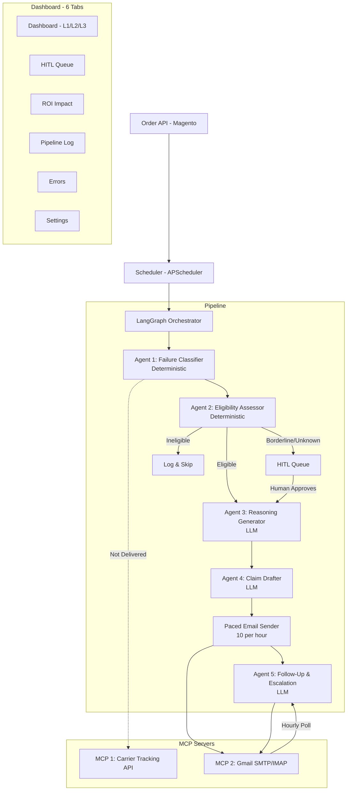

# 🌸 BloomDirect — Automated Shipping Claims Recovery System

> **ISB AMPBA Batch 24 · CT2 Group Assignment · Group 8**  
> Praveen Prakash · Sanskar Jain · Siddharth Kolli · Suparna Dhumale

[](http://3.111.214.25:8501)
[](https://github.com/praveenp1118/bloomdirect-claims-agent)
[](https://langchain-ai.github.io/langgraph/)
[](https://anthropic.com)
[](http://3.111.214.25:8501)

---

## What This Does

BloomDirect ships ~1,000 floral orders/week via UPS Ground, FedEx Ground, and FedEx Air. With a ~10% shipping failure rate, ~100 shipments/week are eligible for carrier guarantee claims. Filing, following up, and resubmitting manually is infeasible — this system automates the entire lifecycle end-to-end.

**~98% deterministic** — LLM tokens only consumed for claim drafting and rejection analysis (~60 claims/week, ~$5–15/month).

---

## 🏗️ System Architecture



---

## Orchestration Patterns

| Pattern | Where | Why |
|---------|-------|-----|
| **Conditional Routing** | After Eligibility Assessor — routes to Claim Drafter, HITL, or skip | Different claim categories need different handling |
| **Iterative Retry Loop** | Follow-Up Agent resubmits rejected claims with escalating tone | 99% of first-attempt claims are rejected |
| **HITL Checkpoint** | Unknown patterns, low probability, high-value claims | Human oversight before automated action |
| **Paced Fan-Out** | Priority queue — urgency → LLM quality → probability DESC | Avoids spam triggers, 10 emails/hour |

---

## Dashboard — 6 Tabs

### Tab 1: Dashboard (L1 / L2 / L3)

**L1 — Summary by Ship Method**

| Column | Description |
|--------|-------------|
| Ship Method | UPS Ground / FedEx Ground / FedEx Air |
| Total Orders | All invoiced orders in window |
| On Time | Delivered within SLA |
| MCP 1 Calls | Tracking API calls made |
| Not On Time | Late / damaged / missing |
| Eligible For Claim | Passed eligibility check |
| Avg Probability | Mean claim success probability |
| MCP 2 Calls | Emails sent |
| Before Mail Reasoning | LLM reasoning generated |

> Clicking any number in L1 drills into **L2 — Per Tracking ID view**

**L2 — Per Tracking ID**
- Short failure label + LLM narrative popup
- Generate / Regenerate buttons (Regenerate disabled if no new events since last generation)
- Clickable tracking ID links:
  - UPS (1Z prefix): `ups.com/track?tracknum={ID}`
  - FedEx (numeric): `fedex.com/wtrk/track/?trackingnumber={ID}`

**L3 — Email Log per Tracking ID**
- Full email trail: subject, body, timestamp, carrier response

---

### Tab 2: HITL Queue

3-step human-in-the-loop workflow:

```
Step 1: Generate Draft  →  Step 2: Review / Edit  →  Step 3: Send / Skip / Close
```

HITL triggered for:
1. FedEx portal claims (technical — no email route)
2. Borderline eligibility or high-value claims
3. Probability drops below 0.3 after rejection
4. Unknown failure pattern — always HITL regardless of score

---

### Tab 3: ROI Impact
Claims filed · rejected · approved · recovery rate · estimated revenue recovered.

### Tab 4: Pipeline Log
Full MCP 1 call log with tracking ID search field.

### Tab 5: Errors
Error log with retry buttons for failed pipeline steps.

### Tab 6: Settings
All thresholds, email mode, LangSmith toggle — configurable without code changes.

---

## Claim Classification Logic

| Event Pattern | Claim Type | Base Probability |
|---------------|-----------|-----------------|
| Mechanical failure / Missed flight | CARRIER_DELAY | 0.75 ⭐ Golden case |
| Damage detected in trail | DAMAGE | 0.65 |
| No delivery event, no scans | LOST | 0.60 |
| Delivered + late | LATE | 0.55 |
| Weather event | CARRIER_DELAY | 0.35 |
| Address error (our fault) | NO CLAIM | — |
| Refused + no damage | NO CLAIM | — |
| Unknown pattern | HITL | — |

**Resubmission:**
- Probability ≥ 0.6 → firm tone, auto-resubmit
- Probability 0.3–0.6 → balanced tone, auto-resubmit
- Probability < 0.3 → HITL queue

---

## FedEx Filing — Layer 1 (Batch Portal)

FedEx does not accept email claims — portal batch upload required.

| Step | Action |
|------|--------|
| 1 | Select eligible FedEx claims in dashboard |
| 2 | Generate Excel batch (deterministic 295-char template — LLM skipped) |
| 3 | Download `.xlsx` and upload to fedex.com/claims (max 200/file) |
| 4 | Mark batch as filed in dashboard |

> **Layer 2 (planned):** Playwright RPA for automated portal submission

---

## Scheduler — 4 Jobs

| Job | Schedule | Description |
|-----|----------|-------------|
| Daily Pipeline | Midnight PST | Full pipeline — not-delivered shipments |
| Daily Follow-Up | Midnight EST | Day 10/14 follow-up · Day 15 HITL routing |
| Paced Sender | Hourly | Priority queue · 10 emails/hour · UPS only |
| Response Poll | Hourly | Gmail inbox check for carrier responses |

**Filing window enforcement:** ≤ 2 days remaining → auto-file, bypass HITL

---

## MCP Servers

### MCP 1 — Carrier Tracking
- UPS: via Shippo API (`/tracks/ups/{tracking_id}`)
- FedEx: via FedEx Track API (OAuth)
- **Cache-first:** `tracking_cache` — `delivered=True` skips forever (~60% API call reduction)
- Fallback to mock data in test mode

### MCP 2 — Email Claims
- Gmail SMTP with App Password
- **UPS** → `support@shippo.com` (shipping aggregator)
- **FedEx** → portal batch (Layer 1) — email route not viable
- Test mode: orange badge, CC disabled, all emails → sandbox
- Production mode: green badge, CC `logistics@arabellabouquets.com`
- Paced: 10 emails/hour, priority order

---

## Guardrails

**Input (`guardrails/input_validator.py`):**
- Pydantic schema validation
- Filing window check — 15-day hard cutoff
- Duplicate detection — `filed` flag + email trail per tracking ID
- Prompt injection detection — gift message / address fields sanitized
- Date normalization — ISO format + timezone handling

**Output (`guardrails/output_validator.py`):**
- PII redaction — customer data never sent to carrier
- Hallucination check — dates/amounts must match source tracking data
- Format enforcement — missing subject/body triggers regeneration
- Gift message stripping — occasion data never included in claim emails

---

## Evaluation — LLM-as-Judge Results

Sub-agent evaluation of the **Claim Drafter Agent** — 15 curated scenarios, judged by Claude Sonnet (April 12, 2026).

| Dimension | Score |
|-----------|-------|
| Tone Appropriateness | 3.60 / 5.0 |
| Factual Accuracy | 4.13 / 5.0 |
| Completeness | 3.47 / 5.0 |
| Actionability | 4.07 / 5.0 |
| **Overall Average** | **3.82 / 5.0** |
| **Pass Rate (≥ 3.5)** | **87% (13/15)** |

| Category | Score |
|----------|-------|
| Carrier Delay — Mechanical | 4.08 |
| FedEx Damage | 4.08 |
| Rejection Resubmission — Firm Tone | 3.75 |
| UPS Late — First Attempt | 3.62 |
| Weather Delay — Low Probability | 3.50 |

```bash
python evaluation/evaluate_drafter.py
```

---

## Quick Start (Local)

```bash
git clone https://github.com/praveenp1118/bloomdirect-claims-agent.git
cd bloomdirect-claims-agent
python -m venv venv
venv\Scripts\activate        # Windows
pip install -r requirements.txt
cp env.example .env          # Add your API keys
python -c "from database.models import init_db; init_db()"
python data/generate_synthetic_data.py
streamlit run dashboard/app.py
```

---

## Docker Deployment

```bash
docker compose up --build -d
docker compose logs -f dashboard
docker compose logs -f scheduler
```

---

## Project Structure

```
bloomdirect-claims-agent/
├── agents/
│   ├── claim_drafter.py           # LLM email drafting (Claude Sonnet)
│   └── followup_escalation.py    # Rejection analysis + resubmission
├── config/
│   └── carrier_policies.json      # SLA definitions per ship method
├── dashboard/
│   ├── app.py                     # Streamlit dashboard (6 tabs)
│   └── pages/
│       ├── 1_MCP_1_Log.py
│       └── 2_MCP_2_Log.py
├── data/
│   └── generate_synthetic_data.py
├── database/
│   └── models.py                  # SQLAlchemy (SQLite / MySQL-compatible)
├── evaluation/
│   ├── evaluate_drafter.py        # LLM-as-Judge evaluation script
│   ├── eval_scenarios.json        # 15 curated drafter test cases
│   ├── evaluation_results.json    # Real scores (Apr 2026)
│   └── scenario_testing.json      # 7 end-to-end pipeline scenarios
├── guardrails/
│   ├── input_validator.py
│   └── output_validator.py
├── mcp_servers/
│   ├── carrier_tracking_mcp.py    # MCP 1: UPS/FedEx tracking
│   └── email_claims_mcp.py        # MCP 2: Gmail SMTP + IMAP poll
├── orchestrator/
│   └── pipeline.py                # LangGraph pipeline
├── scheduler/
│   └── scheduler.py               # APScheduler — 4 jobs
├── scripts/
│   └── generate_fedex_batch.py    # FedEx Excel batch generator
├── docs/
│   └── design_document.html       # Full design document
├── runner_notebook.py             # End-to-end runner (7 scenarios)
├── env.example
├── .gitignore
├── docker-compose.yml
├── Dockerfile
└── requirements.txt
```

---

## Environment Variables

| Variable | Description |
|----------|-------------|
| `ENV` | `test` or `production` |
| `ANTHROPIC_API_KEY` | Claude API key |
| `ORDER_API_KEY` | Arabella Bouquets Bearer token |
| `GMAIL_ADDRESS` | Claims Gmail address |
| `GMAIL_APP_PASSWORD` | Gmail App Password |
| `SHIPPO_API_KEY` | UPS tracking via Shippo |
| `FEDEX_CLIENT_ID` | FedEx Track API credentials |
| `FEDEX_CLIENT_SECRET` | FedEx Track API credentials |
| `LANGCHAIN_TRACING_V2` | `true` to enable LangSmith |
| `LANGCHAIN_API_KEY` | LangSmith API key |
| `LANGCHAIN_PROJECT` | `bloomdirect-claims` |

---

## Default Login

| Field | Value |
|-------|-------|
| Username | `Group_05` |
| Password | `BloomD@2026` |

Required only for HITL approvals and saving Settings. All read-only views are public.

---

## Group 8

| Name |
|------|
| Praveen Prakash |
| Sanskar Jain |
| Siddharth Kolli |
| Suparna Dhumale |

---

*ISB AMPBA Batch 24 · CT2 Group Assignment · Final Submission April 12, 2026*
